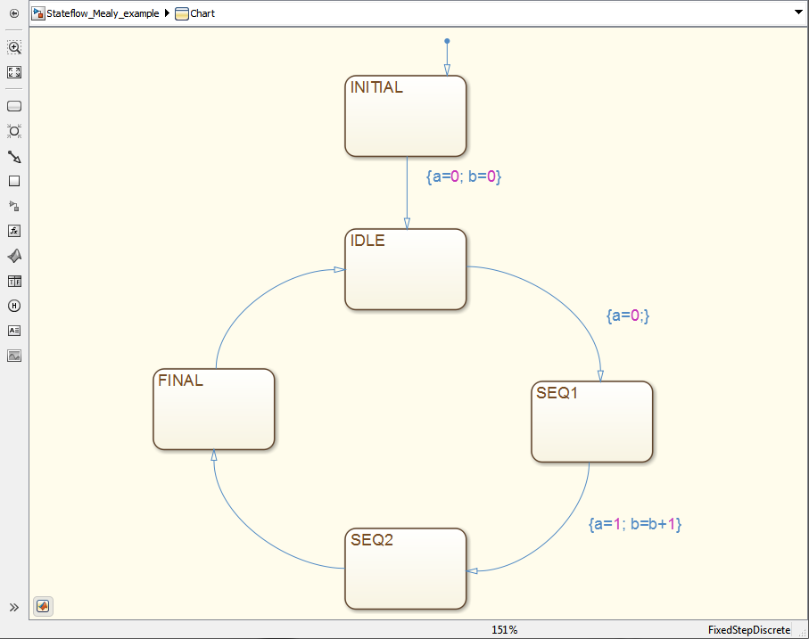
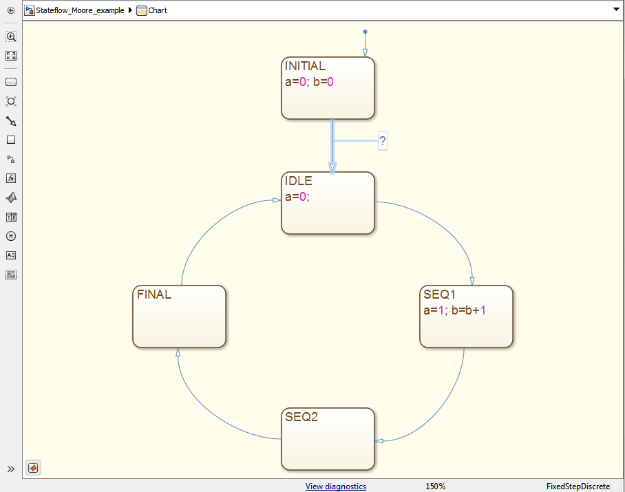

Stateflow Examples
==

Examples of Mealy and Moor State Machines in Simulink Stateflow:

Conditional braching, transition label `[a==1]`.

[Mealy](http://www.mathworks.co.uk/help/stateflow/ug/design-considerations-for-mealy-charts.html)
--

Statelabels

    STATENAME
    
Outputs defined on transitions `{b=1}`. With Conditional transiations `[a==1]{b=1}`.

[Moore](http://www.mathworks.co.uk/help/stateflow/ug/design-considerations-for-moore-charts.html)
--

Statelabels :

    STATENAME
      code ie a=0;

Otherwise a statelabel may look like:

    STATENAME
    entry: code
    during: code
    exit: code
    on event_name
    bind: events

